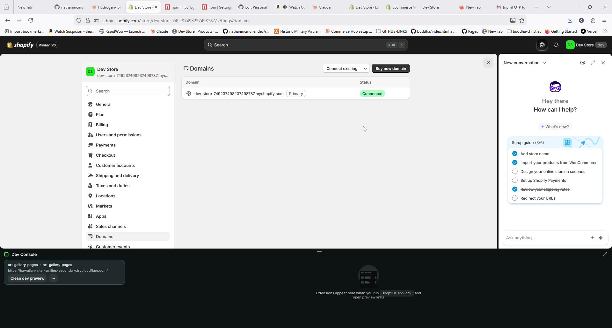
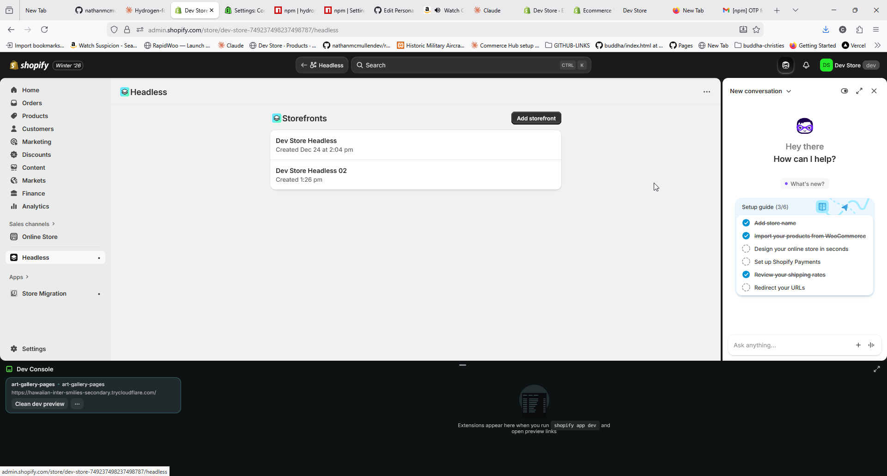
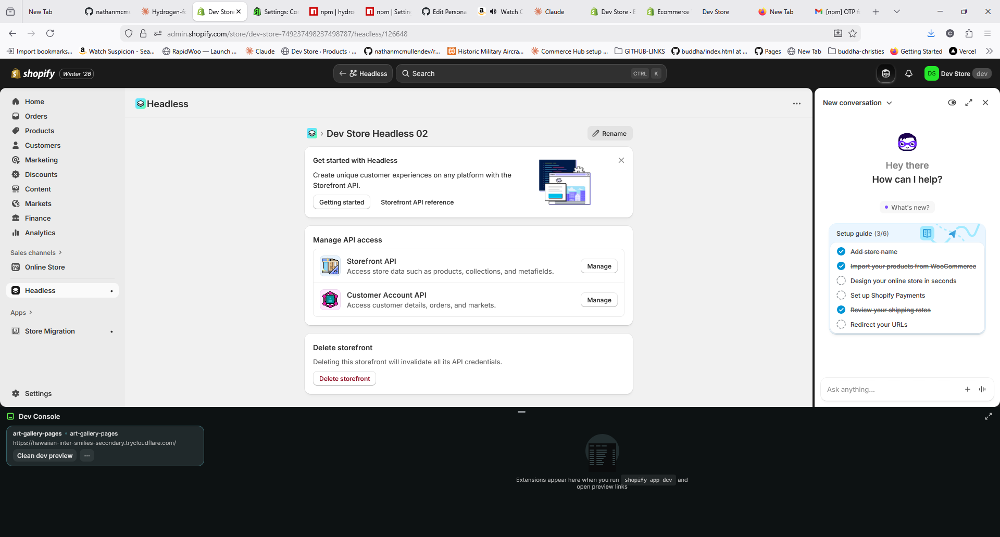
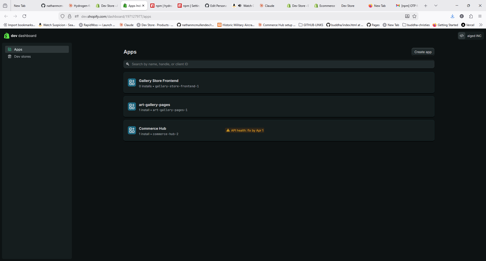
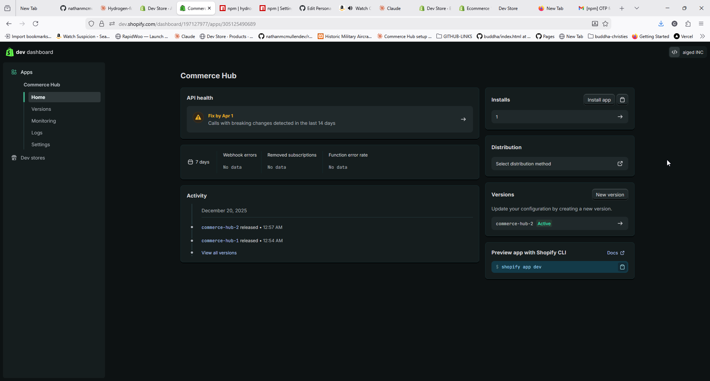
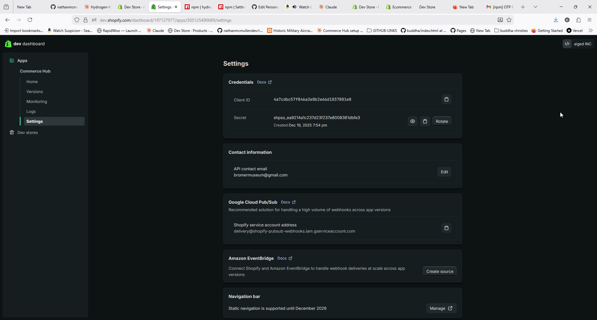

# Finding Your Shopify API Credentials

This guide walks you through finding the three credentials needed to connect Hydrogen Forge to your Shopify store.

## Prerequisites

- A Shopify store (development or production)
- Admin access to your store

---

## 1. Store Domain

Your store domain is the `*.myshopify.com` URL for your store.

### How to Find It

1. Log into your Shopify admin
2. Look at the URL in your browser - it will be something like:
   ```
   https://your-store-name.myshopify.com/admin
   ```
3. Your store domain is: `your-store-name.myshopify.com`



### Common Mistakes

- **Don't use your custom domain** (e.g., `www.mystore.com`) - use the `.myshopify.com` version
- **Don't include `https://`** - just the domain itself
- **Don't include `/admin`** - just the base domain

### Examples

| Correct                  | Incorrect                        |
| ------------------------ | -------------------------------- |
| `my-store.myshopify.com` | `https://my-store.myshopify.com` |
| `my-store.myshopify.com` | `my-store.myshopify.com/admin`   |
| `my-store.myshopify.com` | `www.mystore.com`                |

---

## 2. Storefront API Token

The Storefront API token allows your Hydrogen app to fetch products, collections, and other public store data.

### Step 1: Navigate to Headless Channel

1. In your Shopify admin, click **Sales channels** in the left sidebar
2. Click **Headless**



> **Don't see Headless?** You need to add it first. Click **Sales channels** → **+** → Search for "Headless" → **Add channel**

### Step 2: Select or Create a Storefront

If you already have a Headless storefront:

1. Click on your storefront name

If you need to create one:

1. Click **Add storefront**
2. Enter a name (e.g., "Hydrogen Development")
3. Click **Create**



### Step 3: Access Storefront API Settings

1. Click **Storefront API** in the left sidebar
2. Click **Manage** next to "Storefront API access"


### Step 4: Copy the Public Access Token

1. Find the **Public access token** section
2. Click the **Copy** button or select and copy the token


The token looks something like:

```
a1b2c3d4e5f6g7h8i9j0k1l2m3n4o5p6
```

### Storefront API Permissions

By default, the Storefront API has access to:

- Products and collections
- Shop information
- Cart operations
- Customer accounts (if enabled)

You can customize these under **Storefront API access scopes** if needed.

---

## 3. Admin API Token

The Admin API token gives Claude Code access to manage your store's products, inventory, and other administrative functions through MCP.

### Option A: Use an Existing Token

If you've already set up a Shopify app (for Hydrogen development), you likely have an Admin API token.

**Where to find it:**

1. Check your `.env` file for `SHOPIFY_ADMIN_ACCESS_TOKEN` or similar
2. The token starts with `shpat_` (Admin API access token) or `shpua_` (user access token)

```env
# Example from your .env file
SHOPIFY_ADMIN_ACCESS_TOKEN=shpat_xxxxxxxxxxxxxxxxxxxxxxxxxxxxx
```

### Option B: Create a New Token via Dev Dashboard

If you don't have an existing token, create one through Shopify's Developer Dashboard.

#### Step 1: Go to Developer Dashboard

1. Navigate to [dev.shopify.com](https://dev.shopify.com)
2. Sign in with your Shopify Partners or store account



#### Step 2: Select or Create an App

**If you have an existing app:**

1. Click **Apps** in the sidebar
2. Click on your app name

**If you need to create an app:**

1. Click **Apps** → **Create app**
2. Choose **Create app manually**
3. Enter an app name (e.g., "Hydrogen Forge MCP")
4. Click **Create**



#### Step 3: Configure Admin API Access

1. Click **Configuration** in the app sidebar
2. Under **Admin API integration**, click **Configure** or **Edit**
3. Select the scopes you need:

**Recommended scopes for Hydrogen Forge MCP:**

- `read_products`, `write_products`
- `read_inventory`, `write_inventory`
- `read_orders`
- `read_customers`
- `read_content`

4. Click **Save**


#### Step 4: Install the App on Your Store

1. Click **API credentials** in the sidebar
2. Under **Access tokens**, click **Install app**
3. Select your store and confirm installation


#### Step 5: Get the Admin API Token

1. After installation, you'll see your **Admin API access token**
2. Click **Reveal token once** (you can only see this once!)
3. Copy the token immediately and store it securely



> **Important:** You can only view this token once. If you lose it, you'll need to create a new one.

---

## Putting It All Together

Once you have all three credentials, you can run:

```bash
npx hydrogen-forge create my-store
```

When prompted, enter:

1. **Store domain:** `your-store.myshopify.com`
2. **Storefront API token:** The public access token from Headless
3. **Admin API token:** Your `shpat_` or `shpua_` token

The CLI will create `.mcp.json` with your credentials, and Claude Code will be ready to manage your store.

---

## Security Best Practices

1. **Never commit credentials to git** - The CLI adds `.mcp.json` to `.gitignore` automatically
2. **Use environment variables in production** - Don't hardcode tokens
3. **Rotate tokens periodically** - Especially if team members leave
4. **Use minimal scopes** - Only grant the permissions you actually need
5. **Keep Admin tokens secret** - Storefront tokens are public, but Admin tokens are not

---

## Troubleshooting

### "Invalid API token" error

- Double-check you're using the correct token type (Storefront vs Admin)
- Ensure the token hasn't been revoked
- Verify the store domain matches the token's store

### "Unauthorized" when using MCP tools

- Verify your Admin API token has the required scopes
- Check that the app is installed on the correct store
- Try regenerating the token

### Can't find the Headless sales channel

1. Go to **Sales channels** → **+** (add channel)
2. Search for "Headless"
3. Click **Add channel**

### Token shows as "expired"

Admin API tokens don't expire, but they can be:

- Revoked manually
- Invalidated if the app is uninstalled
- Removed if the store changes ownership

Create a new token following the steps above.

---

## Next Steps

- [Building Your First Hydrogen Store](./GETTING-STARTED.md)
- [Using MCP Tools with Claude Code](./MCP-TOOLS.md)
- [Deploying to Production](./DEPLOYMENT.md)
